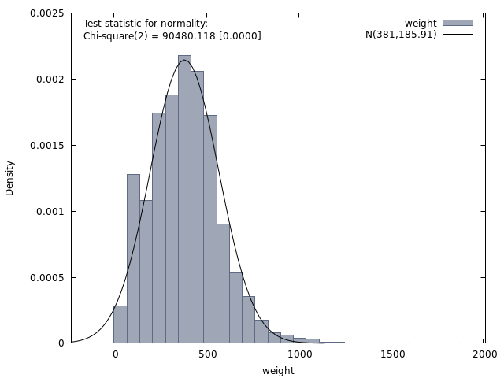

# NOTE ON WEIGHTING

I've produced two sets of weights. Both match household composition and population by age and sex.

* a short run (2014-2021). This has with employment, employment, ilo_unemployment, jsa_claimants from OBR
* a long run to 2031 by household composition, population, labour force participation only.

I'll discuss the long run one here.

# Sources:

## People:

For Scotland: [Projected Population of Scotland (2014-based)][SCOTPOP]. Everywhere else from [ONS Zipped
bundle][ONSBUNDLE](file Z1). We can hit UK-wide, or each country individually.

The three letter key in the file name indicates the projection type the data relates to as follows:

    ppp – principal projection
    hpp – high fertility variant
    lpp – low fertility variant
    php – high life expectancy variant
    plp – low life expectancy variant
    pph – high migration variant
    ppl – low migration variant
    hhh – high population variant
    lll – low population variant
    ppz – zero net migration (natural change only) variant
    
   
    
I match by gender, in 5 - year bands to 79, then 80+. This is a total of 34 Targets.

## Households

All this stuff is scattered and uses inconsistent breakdowns. So in the final weights, seperate breakdowns for each
country are used.

### England

From [ONS][ENGLANDHH]. Breakdown:

    one person households male
    one person households female
    one family and no others couple no dependent children
    a couple and one or more other adults no dependent children
    households with one dependent child
    households with two dependent children
    households with three dependent children
    other households
        

Couldn't find alternative assumption tables.    
    
Problems: mapping from FRS produces many fewer "other households" and many more `one family and no other`, stopping
convergence. These fields are therefore merged.

5 targets.

### Scotland

From [National records of Scotland][SCOTHH]. Breakdown:

    one adult male
    one adult female
    two adults
    one adult one child
    one adult two plus children
    two plus adult one plus children
    three plus person all adult

7 targets.

Three variants available, corresponding to `ppp`, `ppl`, `pph` (see popn above). 

###  N. Ireland 

From [Northern Ireland Household Projections][NIRHH].

2012 based; only 1 variant. 

    one adult households
    two adults without children
    other households without children
    one adult households with children
    other households with children

5 targets.

### Wales:

From [Stats Wales][WALESHH]. No variants available. Breakdown:

    1 person
    2 person no children
    2 person 1 adult 1 child
    3 person no children
    3 person 2 adults 1 child
    3 person 1 adult 2 children
    4 person no children
    4 person 2 plus adults 1 plus children
    4 person 1 adult 3 children
    5 plus person no children
    5 plus person 2 plus adults 1 plus children
    5 plus person 1 adult 4 plus children

12 Targets.
    
Note there is almost no overlap between the 4 countries. Nearest is:

    one adult hh
    two adult hh
    other hh

which seems pointless. So we use all the Household breakdowns, except for England as noted.

## PARTICIPATION

From [OBR Fiscal Sustainability report][OBRSUST] Tables 3-1,3.2. Breakdowns (by males/females): 

    age 16 19 
    age 20 24
    age 25 29
    age 30 34
    age 35 39
    age 40 44
    age 45 49
    age 50 54
    age 55 59
    age 60 64
    age 65 69
    age 70 74
    age 75 plus

Mapped in FRS to `DVIL04A /= 4` in `adult` record. 

OBR figure for 16-19 missing for 2009-2021; interpolated figure is much to high compared to FRS age 16-19 M/F compared
to data. Possibly we need `child` records also. This field, and `75 plus`, dropped from weights targets.

So, 22 targets.

OBR figure is for UK so rates for countries are weighted by [NOMIS][NOMIS] data retrieved 19/10/2017 on country-level
participation rates by age band and gender from Annual Population Survey.

This gives us 87 target cols for the UK wide weighting, 63 for Scotland only. Converged using
constrained_chi_square with bounds 0.05 - 6.0. TODO try narrower bounds.

## Weights Stats

### UK Base Case

(1,893,336 observations)

    Mean                         381.00
    Median                       378.95
    Minimum                      9.4434
    Maximum                      1950.8
    Standard deviation           185.91
    C.V.                        0.48796
    Skewness                    0.57440
    Ex. kurtosis                 1.0269
    5% percentile                85.686
    95% percentile               701.47
    Interquartile range          244.83
    Missing obs.                      0

### SCOT BASE CASE

(278,736 valid observations)

    Mean                         223.40
    Median                       214.45
    Minimum                      20.823
    Maximum                      945.03
    Standard deviation           98.558
    C.V.                        0.44118
    Skewness                     1.4767
    Ex. kurtosis                 6.5580
    5% percentile                81.902
    95% percentile               376.42
    Interquartile range          105.78
    Missing obs.                      0

    
    
[SCOTPOP]:https://www.nrscotland.gov.uk/statistics-and-data/statistics/statistics-by-theme/population/population-projections/population-projections-scotland
[ONSBUNDLE]:https://www.ons.gov.uk/peoplepopulationandcommunity/populationandmigration/populationprojections
[NOMIS]:https://www.nomisweb.co.uk/
[ENGLANDHH]: https://www.gov.uk/government/statistical-data-sets/2014-based-household-projections-detailed-data-for-modelling-and-analytical-purposes
[SCOTHH]: https://www.nrscotland.gov.uk/statistics-and-data/statistics/statistics-by-theme/households/household-projections/2014-based-household-projections
[WALESHH]: http://gov.wales/statistics-and-research/household-projections/?lang=en
[NIRHH]: https://www.nisra.gov.uk/publications/northern-ireland-household-projections-2012-based
[OBRSUST]: http://budgetresponsibility.org.uk/fsr/fiscal-sustainability-report-january-2017/

## Bibliography

‘2014-Based Household Projections in England, 2014 to 2039 - GOV.UK’. Accessed 19 September 2017. https://www.gov.uk/government/statistics/2014-based-household-projections-in-england-2014-to-2039.

‘A05 NSA: Employment, Unemployment and Economic Inactivity by Age Group (Not Seasonally Adjusted) - Office for National Statistics’. Accessed 9 October 2017. https://www.ons.gov.uk/employmentandlabourmarket/peopleinwork/employmentandemployeetypes/datasets/employmentunemploymentandeconomicinactivitybyagegroupnotseasonallyadjusteda05nsa.

‘Data’. Office for Budget Responsibility. Accessed 9 October 2017. http://budgetresponsibility.org.uk/data/.

‘Economic and Fiscal Outlook – March 2017’. Office for Budget Responsibility. Accessed 29 August 2017. http://budgetresponsibility.org.uk/efo/economic-fiscal-outlook-march-2017/.

‘Family Resources Survey: Financial Year 2015/16 - GOV.UK’. Accessed 23 October 2017. https://www.gov.uk/government/statistics/family-resources-survey-financial-year-201516.

‘Fiscal Sustainability Report - January 2017’. Office for Budget Responsibility. Accessed 24 October 2017. http://budgetresponsibility.org.uk/fsr/fiscal-sustainability-report-january-2017/.

‘Glossary:Inactive - Statistics Explained’. Accessed 9 October 2017. http://ec.europa.eu/eurostat/statistics-explained/index.php/Glossary:Inactive.

‘Household Projections for Scotland, 2014-Based | National Records of Scotland’. Accessed 30 August 2017. https://www.nrscotland.gov.uk/statistics-and-data/statistics/statistics-by-theme/households/household-projections/2014-based-household-projections.

‘Household Projections for Scotland, 2014-Based | National Records of Scotland’. Accessed 30 August 2017. https://www.nrscotland.gov.uk/statistics-and-data/statistics/statistics-by-theme/households/household-projections/2014-based-household-projections.

‘Initial Review of the Family Resources Survey Weighting Scheme - GOV.UK’. Accessed 23 October 2017. https://www.gov.uk/government/publications/initial-review-of-the-family-resources-survey-weighting-scheme.

‘Labour Market Statistics Time Series Dataset - Office for National Statistics’. Accessed 9 October 2017. https://www.ons.gov.uk/employmentandlabourmarket/peopleinwork/employmentandemployeetypes/datasets/labourmarketstatistics.

‘Long Term Conditions Projections - Scottish Centre for Telehealth and Telecare’. Accessed 31 August 2017. https://sctt.org.uk/programmes/home-and-mobile-monitoring/long-term-conditions/.

‘Nomis - Official Labour Market Statistics’. Accessed 24 October 2017. https://www.nomisweb.co.uk/.

‘Northern Ireland Household Projections (2012-Based)’. Northern Ireland Statistics and Research Agency, 21 December 2016. https://www.nisra.gov.uk/publications/northern-ireland-household-projections-2012-based.

ONS. ‘Release Edition Reference Tables’. Text, 2 July 2010. http://webarchive.nationalarchives.gov.uk/20160108043217/http://www.ons.gov.uk/ons/publications/re-reference-tables.html?newquery=*&newoffset=50&pageSize=25&edition=tcm%3A77-395151.

‘Population Projections - Office for National Statistics’. Accessed 24 October 2017. https://www.ons.gov.uk/peoplepopulationandcommunity/populationandmigration/populationprojections.

‘Projected Population of Scotland (2014-Based): Additional Variants Using Alternative European Union Migration Assumptions | National Records of Scotland’. Accessed 30 August 2017. https://www.nrscotland.gov.uk/statistics-and-data/statistics/statistics-by-theme/population/population-projections/population-projections-scotland/2014-based-additional-variants.

Scottish Government, St Andrew’s House. ‘Estimated and Projected Diagnosis Rates for Dementia in Scotland 2014-2020’. Research Publications, 13 December 2016. http://www.gov.scot/Publications/2016/12/9363/downloads.

———. ‘Health and Community Care - Statistics Publications’. Info Page, 1 April 2003. http://www.gov.scot/Topics/Statistics/Browse/Health/Publications.

———. ‘More Homes Scotland’. Website Section, 26 February 2016. http://www.gov.scot/Topics/Built-Environment/Housing/reform/more-homes-scotland.

———. ‘Scottish Health Survey’. Website Section, 1 April 2003. http://www.gov.scot/Topics/Statistics/Browse/Health/scottish-health-survey.

‘Snapshot’. Accessed 19 September 2017. https://www.gov.uk/government/statistics/2014-based-household-projections-in-england-2014-to-2039.

Team, National Records of Scotland Web. ‘National Records of Scotland’. Document. National Records of Scotland, 31 May 2013. https://www.nrscotland.gov.uk/statistics-and-data/statistics/statistics-by-theme/population/population-projections/population-projections-scotland.

———. ‘National Records of Scotland’. Document. National Records of Scotland, 31 May 2013. /statistics-and-data/statistics/statistics-by-theme/housholds/household-projections.

‘Welsh Government | Household Projections’. Accessed 17 October 2017. http://gov.wales/statistics-and-research/household-projections/?lang=en.

‘Z5 - Zipped Population Projections Data Files - Extra Variants, Scotland - Office for National Statistics’. Accessed 4 September 2017. https://www.ons.gov.uk/peoplepopulationandcommunity/populationandmigration/populationprojections/datasets/z5zippedpopulationprojectionsdatafilesextravariantsscotland.
